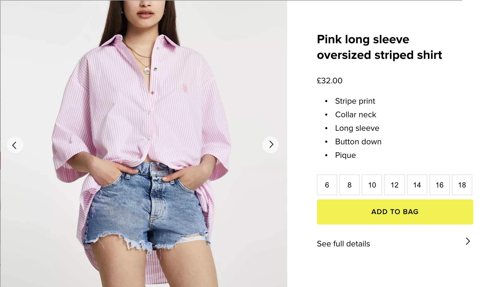

# River Island Technical Assessment

Thank you for choosing to interview with River Island. To help make your interview as productive as possible and to give you a chance to showcase your knowledge we would like you to complete a simple technical task.

## The Task

We would like you to create a simple product card using the mock JSON data provided in /src/data/product.json. We've done some of the ground work and included the minimal set of the packages and tools you should need such as React, Webpack Dev Server, Jest and Babel. You can add other packages as you wish.

Plesae do not spend more than 1 hour on the task. We are not expecting a finished product. 

## The Product Card

The product card should look like the image below with all data, where possible, coming directly from the JSON file as if it were an API response. The image below is from a desktop layout, you should consider how this will work on a mobile devices.

 We do not expect you to create a working carousel or add to bag button.

## The Output

When complete, please remove the node_modules directory and any other directories listed in the .gitignore file. Return the project to us as a zip file. During the interview you will be asked to talk us through how you tackled the task, your thought process and your code. 

